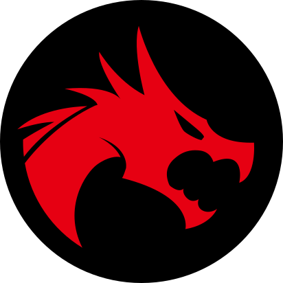

 ⚠️⚠️ This repository contains experimental code and might not be suitable for production use.

    

<h1 align="center" style="padding-top: 0; margin-top: 10px">FDM Monster CLI</h1>

 

<h2 align="center">
<a href="https://docs.fdm-monster.net/" target="_blank">Documentation</a>
</h2>

## What is FDM Monster CLI?

FDM Monster CLI is a Command-Line-Interface for installing the FDM Monster server.

Please check out the main repository here: [https://github.com/fdm-monster/fdm-monster](https://github.com/fdm-monster/fdm-monster)

## Getting started

Check out the [Documentation](https://docs.fdm-monster.net). Are you interested in running the Raspberry Pi image?
Please jump ahead [MonsterPi Section](https://docs.fdm-monster.net/guides/monsterpi).

### Reach out for questions

Please join the discord, but stay professional and proactive!

- Discord server: [https://discord.gg/mwA8uP8CMc](https://discord.gg/mwA8uP8CMc)
- Website: [https://fdm-monster.net](https://fdm-monster.net)
- Mail: davidzwa@gmail.com

## Contributors ✨

These are the people involved in the project. Find the meaning of the emoji keys [here](https://allcontributors.org/docs/en/emoji-key).

<!-- ALL-CONTRIBUTORS-BADGE:START - Do not remove or modify this section -->

<!-- ALL-CONTRIBUTORS-BADGE:END -->

<!-- ALL-CONTRIBUTORS-LIST:START - Do not remove or modify this section -->
<!-- prettier-ignore-start -->
<!-- markdownlint-disable -->
<table>
  <tbody>
  </tbody>
</table>

<!-- markdownlint-restore -->
<!-- prettier-ignore-end -->

<!-- ALL-CONTRIBUTORS-LIST:END -->

<!-- ALL-CONTRIBUTORS-LIST:START - Do not remove or modify this section -->
<!-- prettier-ignore-start -->
<!-- markdownlint-disable -->
<!-- markdownlint-restore -->
<!-- prettier-ignore-end -->

<table></table>

<!-- ALL-CONTRIBUTORS-LIST:END -->

## Contribute

Feel like joining in as a developer or do you have a quick fix? Great! Please read
the [CONTRIBUTING](CONTRIBUTING.md) file.

## License

FDM Monster CLI is licensed with [MIT](LICENSE). For details, please consult the [LICENSE](LICENSE) file.
